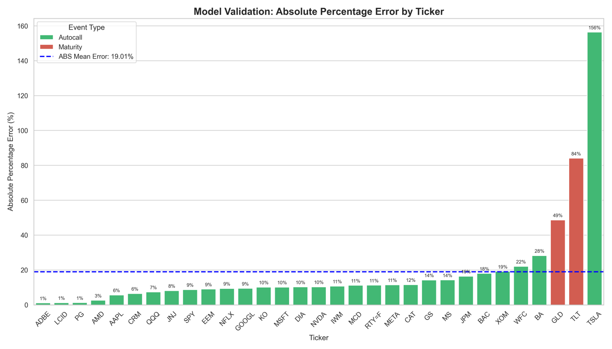
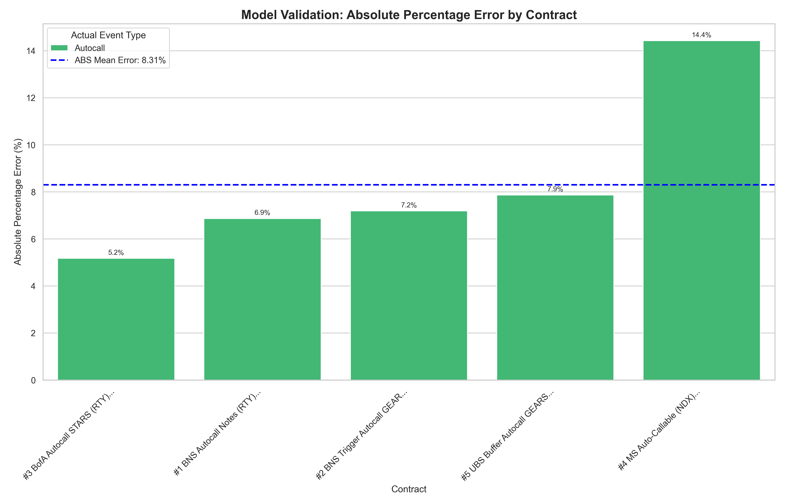

# Methodology for P-Measure Forecasting of Autocallable Structured Products

---

## 1. Introduction and Objective

Structured Products are prepackaged investments that combine traditional financial instruments with embedded derivatives. This hybrid structure links returns to the performance of an underlying asset, making them a dominant instrument for investors seeking yield enhancement in low interest-rate environments. Auto-callable structured notes specifically account for 70% of total structured note issuance, representing an estimated $185.3 billion market in 2024 (an 8.1% CAGR) [1]. 

However, secondary market illiquidity forces investors to rely on issuer-provided valuations. These Mark-to-Market (MtM) prices often suffer from high variance (‘noise’) due to the limitations of standard Monte Carlo (MC) engines [2]. Given the sector’s scale, there is a critical need for variance-reduced pricing methods to provide clients with transparent and consistent valuation snapshots on a day-to-day basis.

The objective of this project is to outline a variance-reduced, "real-world" forecasting methodology for estimating the expected payoff of such products. This approach is distinct from risk-neutral (**Q-measure**) pricing, as its goal is not to find a fair market price, but to forecast a range of potential outcomes based on historical, real-world data (**P-Measure**).

The core of this forecasting engine is a Monte Carlo simulation that employs the One-Step-Survival (OSS) technique [3], effectively a truncated distribution sampling method that smooths discontinuities inherent in barrier products.

---

## 2. Forecasting Approach: The P-Measure

A critical distinction must be made between pricing and forecasting.

* **Q-Measure (Risk-Neutral Pricing):** Used to find the "fair" price of a derivative. It assumes the expected return (drift) of all assets is the risk-free rate, $r_f$. The drift term $\mu$ is set to $\mu = r_f - b$, where $b$ is the dividend yield.
* **P-Measure (Real-World Forecasting):** Used to forecast the *actual* expected behavior of an asset. It uses the asset's *historical* drift ($\mu_{hist}$) and volatility ($\sigma_{hist}$).

Since our objective is a real-world forecast, we utilize the P-Measure. This requires two key parameter adjustments.

### 2.1 P-Measure Model Parameters

#### 2.1.1 Historical Drift ($\mu$)

The drift $\mu$ is not the risk-free rate, but is calculated from the asset's historical log returns. The simulation equation for Geometric Brownian Motion (GBM) is:

$$S_{j+1} = S_{j}\exp\left((\mu - \frac{\sigma^{2}}{2})\Delta t + \sigma\sqrt{\Delta t}Z_{j}\right)$$

The term $\mu$ in this equation is the arithmetic mean return (or expected return). Our model estimates this by first finding the annualized mean of log returns ($\mu_{\log}$) and then converting it to the required arithmetic mean:

$$\mu = \mu_{\log} + \frac{1}{2}\sigma^2$$

#### 2.1.2 Discount Rate ($r$)

For a P-Measure forecast to be internally consistent, the expected future payoffs must be discounted at the same rate used for the simulation's drift. If we simulate paths using a high historical drift $\mu$, we must also discount the resulting payoffs using that same high rate to avoid inflating the present value. Therefore, for this P-Measure forecast, we set the discount rate $r$ to be equal to the historical arithmetic drift $\mu$:

$$r = \mu$$

---

## 3. The Simulation Algorithm

Standard Monte Carlo (SMC) simulations for financial derivatives like autocallable notes rely on stochastic calculus to model the random evolution of asset prices over time. This approach typically uses Geometric Brownian Motion (GBM), a continuous-time stochastic process that serves as the mathematical foundation for simulating price paths, modeled in the equation below.

$$dS_{t} = \mu S_{t} dt + \sigma S_{t} dW_{t}$$

The binary "hit-or-miss" mechanic implemented in SMC creates a sharp discontinuity in the payoff function. In standard simulations, this leads to high variance or "noise," where slight changes in inputs or random seeds cause significant jumps in the estimated value.

To solve this, we implement the One-Step Survival (OSS) estimator [3]. Instead of simulating a path and checking if it hits the barrier, the OSS algorithm restricts sampling, forcing the simulation to continue to maturity and analitically calculates the exact probability that the iteration hits the barrier given current price and volatility.

By replacing binary outcomes with stable probability weights, the model reduces variance by 3x and provides a stable MtM.

---

## 4. Validation Methodology and Results

To rigorously validate the forecasting methodology, we employed a two-stage testing process comparing our model's forecasts against actual historical market outcomes. To test the performance of the model, we implement an **Absolute Percentage Error (APE)**  

$$APE = | \frac{\text{Theoretical} - \text{Actual}}{\text{Actual}}|$$

### 4.1 Phase 1: Standardized Contract Mass Validation

We first implemented a mass validation across a diversified sample of 31 different tickers, representing the most commonly traded underlyings (e.g., SPY, QQQ, RTY) as well as commodities and industry-specific ETFs. To ensure comparability, we applied a standardized contract structure (3-year tenor, 100% barrier, quarterly observation) to all assets.

**Results:**
The model demonstrated strong accuracy with a mean **Absolute Percentage Error (APE) of 19.01%**. *Refer to Figure 1 below*. In this figure we compare the forecast vs actual through a APE.

Figure 1

* The results indicated the model was highly accurate for medium-low volatility products that were autocalled.
* However, the model showed sensitivity to highly volatile products that reached maturity (e.g., TSLA, TLT), where the deviation between historical P-Measure drift and market expectations was greatest.

### 4.2 Phase 2: Real-World Contract Validation

Real-world autocallable notes are not homogenous; issuers tailor barriers and coupons to the volatility of the underlying asset. To validate the model in a realistic setting, we extracted parameters from five specific issuer filings (prospectuses) and simulated them using their exact legal specifications.

**Results:**
By tailoring the simulation to the actual contract terms, the P-Measure forecast aligned much more closely with the product's design.

Figure 1

* The mean error rate improved significantly compared to the standardized test. 
* This confirms that the "noise" observed in Phase 1 was largely due to the mismatch between the standardized structure and the asset's volatility profile. When aligned with the specific structural design of the note (e.g., specific observation dates and buffers), the forecasting methodology proves highly efficient.

---

## 5. Conclusion

This project establishes a robust framework for forecasting the real-world performance of autocallable structured products. By shifting from risk-neutral pricing to a P-Measure forecast and implementing the variance-reduced One-Step Survival (OSS) algorithm, we successfully mitigated the simulation noise typically associated with discontinuous barrier payoffs. 

The results highlight that while the model achieves a baseline accuracy of ~19% across standardized queries, its predictive power is substantially improved when applied to actual issuer filings. Ultimately, this methodology provides investors with a stable, data-driven tool to estimate expected realized yields, offering valuable transparency beyond issuer-provided Mark-to-Market valuations.

---

### References

1.  Growth Market Reports. *Autocallable Notes Market Research Report 2033*. Market Research Report, 2024.
2.  U.S. Securities and Exchange Commission. *Investor Bulletin: Structured Notes*. SEC Office of Investor Education and Advocacy, Jan. 2015.
3.  Paul Glasserman, Jeremy Staum. *Conditioning on One-Step Survival for Barrier Option Simulations*. Operations Research, Vol. 49, No. 6, 2001.
