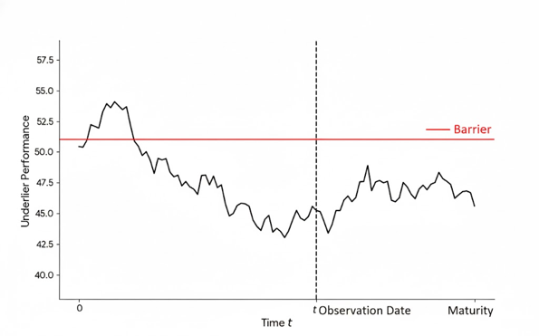
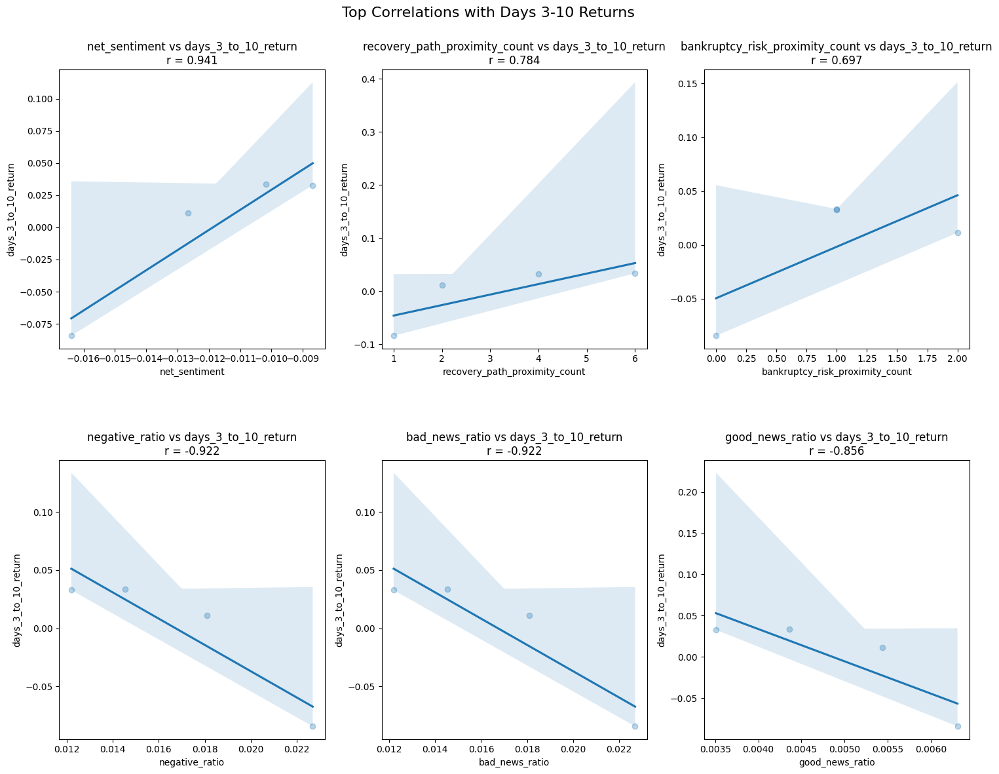
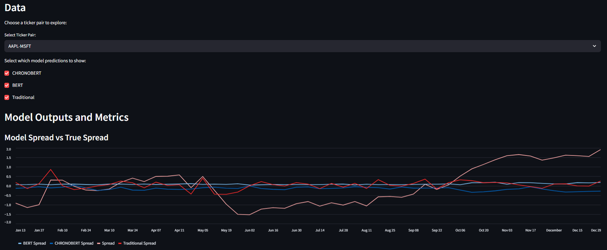

## About Me
**Lehigh University Class of 2025**
 
Integrated Business and Engineering Honors Program
 
Industrial and Systems Engineering
 
Finance Double Major
 

  
  
    <a href="https://ibe.lehigh.edu/welcome-lehighs-ibe-honors-program">
      <strong><em>Read About Lehigh's Integrated Business and Engineering (IBE) Honors Program</em></strong>
    </a>
  

---

I am passionate about the Financial Services Sector. Constantly looking to apply technical mathemtatics through data science methods in multidisciplinary projects throughout my academic and personal endeavors. Ultimately a curious thinker and problem solver.

---

## Project Portfolio

<!-- You can link to other websites, PDFs in this repo, and other pages in this repo -->
_**[Financial Engineering - Autocallable Methodology for P-Measure Forecasting of Autocallable Structured Products]**_

Autocallable structured notes represent a dominant segment of the financial landscape, representing an estimated market size of $185.3 billion in 2024. Due to the iliquidity of the secondary market, investors often rely on issuer provided Mark-to-Market valuations. Standard Montecarlo pricing engines often struggle with the specific discontinuities of these products, leading to high variance or "noise" in daily valuation snapshots. The objective of this project is to outline a variance-reduced forecasting methodology for estimating the expected payoff of such products and provide stable and consistent valations. 

  

---

_**[Financial Engineering - Natural Language Processing 10-Ks to Identify Risk](report.md)**_

<!-- You can show off your midterm analysis by moving the report components and output into this file. Or... -->
Using data dictionaries and word sentiment ratings along with financial topic word compilations, the 10-k documents for the S&P 500 firms were scraped and compared to returns around the day of the 10-k filing date to identify correlation metrics between document sentiment variables and stock returns.

    

---

_**[Financial Engineering - Bert and ChronoBert Time Series Analysis using Pairs Trading](https://chronopairs.streamlit.app/){:target="_blank"}**_

This project explores whether CHRONOBERT, a Transformer-based model trained on chronologically ordered data, can improve financial time series forecasting, particularly in the context of pairs trading.

    

<!--  -->

<!-- --- -->

<!-- _**[Data Science - Formula 1 Race Predictions](main)**_ -->

<!-- Using historical Formula 1 data, I created a Machine Learning model using Random Forest to predict outcomes of Formula 1 races. -->

<!--  -->

<!-- ---
_**[Financial Optimization - ](main)**_

Insert Project description here... -->

<!--  -->

---

